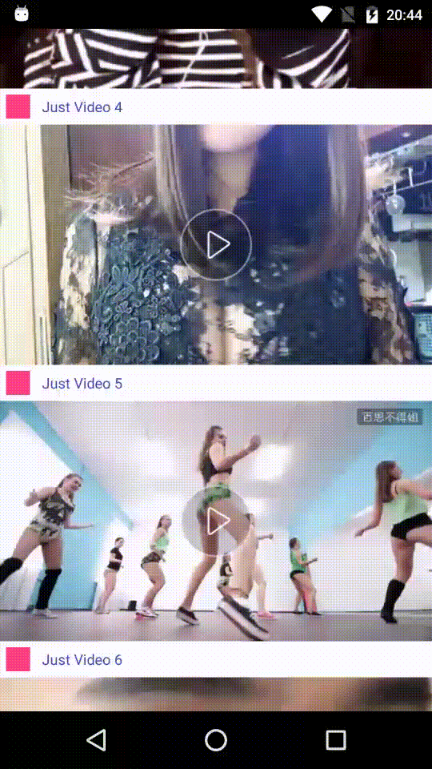

# Play video in ListView,RecyclerView,and support full-screen,and more feature about video play control

## The same as "今日头条" "UC头条" "腾讯视频" video model. 

# EFFECT

[YOUTUBE Video](https://youtu.be/HEVXZVjTPBk)

##Feature

- [x] Scroll to stop playing video when item is gone

- [x] Support portrait and landscape to play video

- [x] Can control video volume,brightness,progress

- [x] Support ListView,RecyclerView

- [ ] More video play control by ITEM VISIBILITY

### How to use

More details see demo code

#THANKS

[VideoPlayerManager](https://github.com/danylovolokh/VideoPlayerManager): Changes happened in many places,
so there is no plan PR to origin lib.

[VideoControllerView](https://github.com/brucetoo/VideoControllerView): For more feature about video play control

## License

Copyright 2016 Bruce too

Licensed under the Apache License, Version 2.0 (the "License");
you may not use this file except in compliance with the License.
You may obtain a copy of the License at

    http://www.apache.org/licenses/LICENSE-2.0

Unless required by applicable law or agreed to in writing, software
distributed under the License is distributed on an "AS IS" BASIS,
WITHOUT WARRANTIES OR CONDITIONS OF ANY KIND, either express or implied.
See the License for the specific language governing permissions and
limitations under the License.

See [LICENSE](LICENSE) file for details.